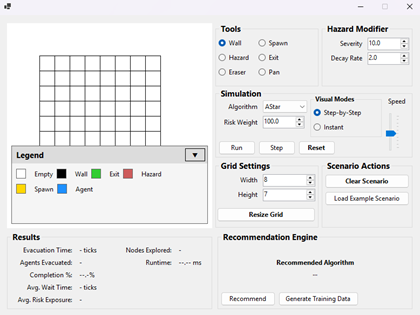
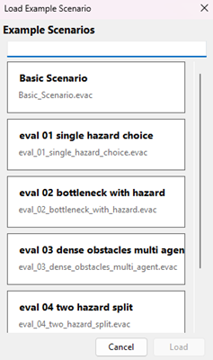

# Hazard-Aware Evacuation Simulator


A C# WinForms evacuation simulation system that allows users to design custom scenarios, run multi-agent evacuations, compare different traversal algorithms under hazard constraints, and generate a recommendation on which algorithm would perform the best based on scenario features.

The quality of routes during an evacuation directly affect safety. Different layouts and hazards in the area will change which routing strategy will perform the best (ideally, the safest and quickest routes). The intended users of this program are A-Level Computer Science students, who learn about different graph traversal algorithms in the course. These users required a way to compare these algorithms and inspect their behaviour on a variety of scenarios to support their learning.

## Key Features

- Create and edit 2D evacuation scenarios
- Place walls, exits, agents, and hazards on a grid
- Simulate multi-agent evacuations over time
- Compare multiple pathfinding algorithms:
  - Breadth-First Search (BFS)
  - Dijkstra’s Algorithm
  - A* Search
  - Greedy Best-First Search
- Apply hazard-aware path costs to model unsafe areas
- Benchmark algorithm performance using simulation metrics
- Recommend a suitable algorithm using a K-Nearest Neighbours (KNN) model
- Load example scenarios for classroom use

## System Overview

The project is structured around several key parts:

### User Interface
The WinForms UI allows users to:
- create, edit, and load scenario layouts
- configure scenarios
- run simulations
- view metrics and algorithm results

### Simulation Engine
The simulation engine manages:
- agent movement
- tick-based updates
- same-cell movement conflicts
- evacuation progress

### Pathfinding Layer
The pathfinding layer contains each implemented algorithm, allowing them to be used and compared under the same scenario.

### Recommendation Subsystem
The recommendation subsystem extracts scenario features and uses a KNN classifier to suggest the most suitable algorithm based on previously benchmarked scenario cases.

## Hazard-Aware Routing
A major aspect of the project is the use of hazard-aware traversal cost. The simulator considers cells closer to a hazard (or risk source) as more "costly", allowing the system to model situations where the shortest geometric route does not translate to the safest route.

## Recommendation Engine
The system includes a simple recommendation feature, using the K-Nearest Neighbours algorithm (KNN) to suggest the best algorithm for a given scenario. 

The recommendation given by the engine is based on certain scenario features such as:
- grid dimensions
- number of agents
- number of exits
- number of hazards
- average hazard severity
- obstacle/wall density
- minimum spawn to hazard distance
- minimum exit to hazard distance

This subsystem was implemented as a secondary feature, mainly to introduce myself to machine learning concepts. Although a simple implementation of machine learning, it  still proved to be a valuable learning experience.

## Screenshots / Demo



https://github.com/user-attachments/assets/b513da2e-aff4-48b9-8713-3ab6c87cadfc

## Tech Stack
- C#
- .NET / WinForms
- JetBrains Rider
- Custom pathfinding and simulation logic
- KNN-based recommendation logic

## Start-Up Instructions
1. Clone this repository
2. Open the solution in your preferred IDE
3. Build the project
4. Run the WinForms application

## Project Structure
```text
solution/EvacuationSimulator/EvacuationSimulator
├── Algorithms/
├── Core/
├── Data/
└── UI/
```

## Example Workflow
1. Create/load an evacuation scenario
2. Place exits, walls, agents, and hazards
3. Select a pathfinding algorithm
4. Run the simulation
5. Compare metrics such as evacuation performance and algorithm behaviour
6. Use the recommendation feature to identify the potential best algorithm for similar scenarios

## Project Limitations
* The project simplifies a space by using a 2D grid representation
* Hazard behaviour is modelled, not physically simulated
* Recommendation quality is dependant on benchmark data and chosen features
* The application is desktop-based only

## Potential Improvements
* Add more realistic crowd behaviour
* Support larger, more complex maps
* Improve hazard modelling
* Expand the recommendation system using more data or a more advanced ML algorithm
* Add more insightful metrics and visual analytics

## Documentation
Further detail can be found in the full [Project report](docs/Project%20Report.docx) included under ```docs/```.
